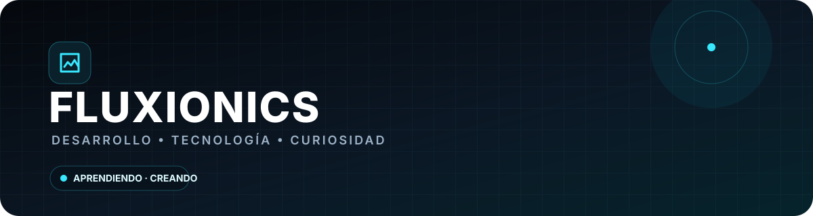

  

  

 

<table><tr>
<td width="58%" valign="top">

# Hola, soy Fluxionics

Me gusta **crear, experimentar y aprender haciendo**.

No tengo todo perfectamente planeado ni pretendo saberlo todo. Muchas veces aparece una idea, empiezo a investigar cómo podría hacerla y termino aprendiendo muchísimo durante el proceso.

La tecnología para mí es una mezcla bastante simple:

**curiosidad + creatividad + prueba y error.**

Me gusta descubrir cómo funcionan las cosas, construirlas por mi cuenta y después pensar:

> **"¿Y si lo hacemos mejor?"**

Y aquí empieza el problema.

</td>
<td width="42%" valign="top"></td>
</tr></table>

---

<h1>SOBRE MÍ</h1>

<table><tr>
<td width="33%" align="center"><h3>CURIOSO</h3>Si algo llama mi atención, probablemente terminaré investigándolo hasta entenderlo.</td>
<td width="33%" align="center"><h3>CREADOR</h3>Me gusta convertir ideas en cosas que realmente existan y puedan usarse.</td>
<td width="33%" align="center"><h3>EXPERIMENTADOR</h3>Aprendo probando. A veces funciona a la primera.  Normalmente no.</td>
</tr></table>

 

<table><tr>
<td width="50%"><h2>MI FORMA DE APRENDER</h2><pre>IDEA
  ↓
PRUEBA
  ↓
ERROR
  ↓
INVESTIGACIÓN
  ↓
ARREGLO
  ↓
"AHHHHH"
  ↓
MEJORA
  ↓
NUEVA IDEA</pre></td>
<td width="50%"><h2>MI FILOSOFÍA</h2><pre>No sé
  ↓
Lo investigo
  ↓
Lo pruebo
  ↓
No funciona
  ↓
Lo vuelvo a intentar
  ↓
Ahora funciona
  ↓
NO TOCAR</pre></td>
</tr></table>

---

 

<table><tr>
<td width="50%"><h3>ESTADO ACTUAL</h3><pre>STATUS       ONLINE
MODO         BUILD
CURIOSIDAD   MAX
IDEAS        TOO MANY
BUGS         CLASSIFIED
SUEÑO        NOT FOUND
MOTIVACIÓN   100%</pre></td>
<td width="50%"><h3>ESTADÍSTICAS TOTALMENTE OFICIALES</h3>

| Métrica | Valor |
|:---|:---:|
| Ideas repentinas | ∞ |
| "Solo un cambio" | 100% |
| Ganas de aprender | ∞ |
| Dormir temprano | 17% |
| Bugs → experiencia | 100% |

</td></tr></table>

---

<h1>TECNOLOGÍA</h1>  Herramientas con las que experimento, aprendo y construyo.

 

<table><tr><td width="50%"><h3>DESARROLLO</h3><pre>HTML
CSS
JavaScript
TypeScript
Python
Java</pre></td><td width="50%"><h3>ENTORNO</h3><pre>Git
GitHub
VS Code
Linux
Terminal
Automatización</pre></td></tr></table>

---

---

<h1>COSAS QUE ME GUSTAN</h1>

<table><tr>
<td width="25%" align="center"><h3>PROGRAMAR</h3>Crear cosas y ver cómo pasan de una idea a algo real.</td>
<td width="25%" align="center"><h3>TECNOLOGÍA</h3>Descubrir herramientas nuevas y aprender cómo funcionan.</td>
<td width="25%" align="center"><h3>VIDEOJUEGOS</h3>Especialmente cuando puedo construir, experimentar o perder demasiado tiempo.</td>
<td width="25%" align="center"><h3>PERSONALIZAR</h3>Modificar interfaces, sistemas y cosas hasta que se sientan realmente mías.</td>
</tr></table>

---

<h1>UN POCO DE MI HISTORIA</h1>

Desde que empecé a interesarme cada vez más por la tecnología, he ido aprendiendo principalmente de una forma:

**hacer cosas.**

No todo sale bien. No todo sale bonito. Y definitivamente no todo sale a la primera.

Pero cada error termina enseñando algo.

> Mi camino no ha sido una línea recta. Ha sido más parecido a **probar → equivocarme → aprender → volver a intentar**.

---

# MODO DESARROLLADOR

<table><tr><td width="50%" align="center"><h3>CUANDO FUNCIONA</h3><pre>¿Funciona?
   │
   ▼
NO TOCAR.
   │
   ▼
CERRAR EDITOR.
   │
   ▼
FIN.</pre></td><td width="50%" align="center"><h3>CUANDO NO FUNCIONA</h3><pre>Revisar
  ↓
Buscar
  ↓
Probar
  ↓
Romper otra cosa
  ↓
Arreglar
  ↓
Aprender</pre></td></tr></table>

---

---

<h1>DISCORD</h1>

---

# ALGUNAS VERDADES

| Frase | Resultado |
|:---|:---|
| "Solo voy a cambiar una cosa." | Mentira |
| "Esto debería ser fácil." | Famosas últimas palabras |
| "Ya sé qué pasa." | Probablemente no |
| "Ya quedó." | No necesariamente |
| "Lo dejo para mañana." | 03:00 AM |
| "No voy a añadir nada más." | Se añadió algo más |

---

# EN RESUMEN

**Me gusta crear.**

**Me gusta aprender.**

**Me gusta experimentar.**

**Me gustan los videojuegos.**

**Y aparentemente también me gusta complicarme la vida con código.**

 

`LEARN → BUILD → BREAK → FIX → IMPROVE → REPEAT`

  

 

No sé exactamente dónde voy a terminar. Pero seguramente voy a estar intentando construir algo.

