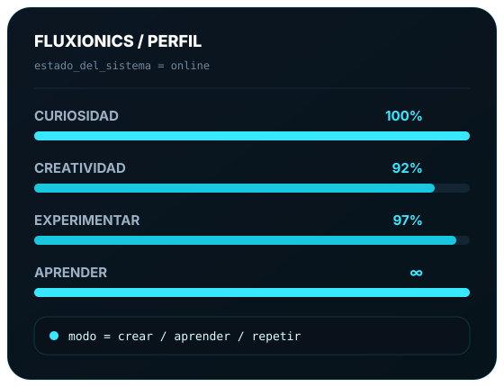
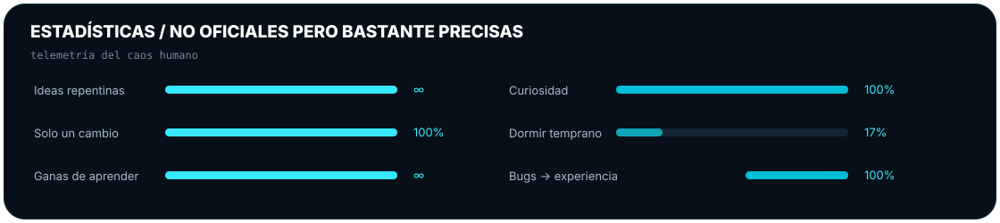
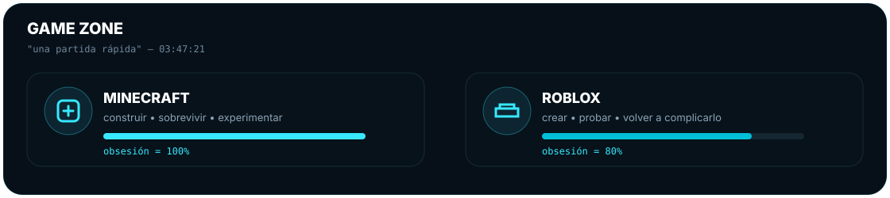
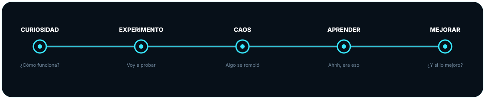
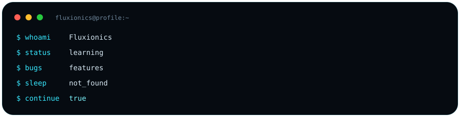
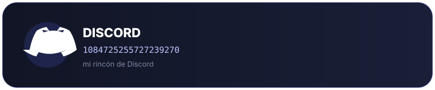
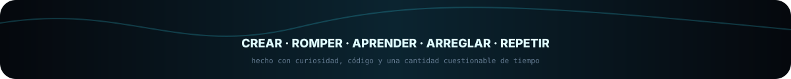

<div align="center">


<br>


<br><br>

<a href="https://github.com/Fluxionics"></a>
<a href="https://discord.com/users/1084725255727239270"></a>
<a href="mailto:fluxionics.dev@gmail.com"></a>


</div>

---

<div align="center">

</div>

## 🚀 Sobre Mí

> **"Crear primero. Entender después. Mejorar siempre."**

Soy un desarrollador apasionado que aprende construyendo. Mi camino no es una línea recta—es un ciclo de **ideas → experimentos → fallos → investigación → soluciones → avances → mejores soluciones**.

No finjo saberlo todo. Prefiero **explorar, experimentar y construir**. Cada bug es una lección. Cada momento de "funciona" es una victoria que vale la pena celebrar.

<table>
<tr>
<td width="33%" align="center">
<br>
<b>🔍 CURIOSIDAD</b><br><br>
Si algo llama mi atención,<br>investigo hasta entenderlo.
<br><br>
</td>
<td width="33%" align="center">
<br>
<b>⚡ CREACIÓN</b><br><br>
Las ideas son el inicio.<br>Soluciones funcionales son la meta.
<br><br>
</td>
<td width="33%" align="center">
<br>
<b>🧪 EXPERIMENTACIÓN</b><br><br>
A veces sale a la primera.<br>Normalmente toma unas iteraciones.
<br><br>
</td>
</tr>
</table>

---

<div align="center">

</div>

## 📊 Analíticas de GitHub

<table>
<tr>
<td width="50%" align="center">

</td>
<td width="50%" align="center">

</td>
</tr>
</table>

<table>
<tr>
<td width="50%" align="center">

</td>
<td width="50%" align="center">

</td>
</tr>
</table>

---

<div align="center">

</div>

## 🛠 Stack Tecnológico

<div align="center">

</div>

<br>

<table>
<tr>
<td width="33%" valign="top">

### **Frontend**
`HTML5` · `CSS3` · `JavaScript` · `TypeScript`  
`React` · `Next.js` · `Tailwind CSS`

</td>
<td width="33%" valign="top">

### **Backend**
`Node.js` · `Python` · `Java`  
`REST APIs` · `GraphQL` · `WebSockets`

</td>
<td width="33%" valign="top">

### **Herramientas y DevOps**
`Git` · `GitHub` · `VS Code`  
`Linux` · `Docker` · `CI/CD`  
`PostgreSQL` · `MongoDB`

</td>
</tr>
</table>

---

<div align="center">

</div>

## 🎯 Proyectos Destacados

<table>
<tr>
<td width="50%" valign="top">

### 🌟 **Nombre del Proyecto**
**Tech:** `React` · `TypeScript` · `Node.js`  
Una breve descripción de qué hace este proyecto y por qué importa.  
[🔗 Repositorio](https://github.com/Fluxionics) • [🌐 Demo](#)

</td>
<td width="50%" valign="top">

### 🌟 **Nombre del Proyecto**
**Tech:** `Python` · `FastAPI` · `PostgreSQL`  
Una breve descripción de qué hace este proyecto y por qué importa.  
[🔗 Repositorio](https://github.com/Fluxionics) • [🌐 Demo](#)

</td>
</tr>
<tr>
<td width="50%" valign="top">

### 🌟 **Nombre del Proyecto**
**Tech:** `Next.js` · `Tailwind` · `Vercel`  
Una breve descripción de qué hace este proyecto y por qué importa.  
[🔗 Repositorio](https://github.com/Fluxionics) • [🌐 Demo](#)

</td>
<td width="50%" valign="top">

### 🌟 **Nombre del Proyecto**
**Tech:** `Java` · `Spring Boot` · `Docker`  
Una breve descripción de qué hace este proyecto y por qué importa.  
[🔗 Repositorio](https://github.com/Fluxionics) • [🌐 Demo](#)

</td>
</tr>
</table>

> **¿Quieres ver más?** Revisa mis [repositorios](https://github.com/Fluxionics?tab=repositories) para la colección completa.

---

<div align="center">

</div>

## 💻 Flujo de Trabajo

<table>
<tr>
<td width="50%" align="center">

### **CUANDO FUNCIONA**

```text
¿Funciona?
     ↓
NO TOCAR
     ↓
CERRAR EDITOR
     ↓
DEPLOY 🚀
```

</td>
<td width="50%" align="center">

### **CUANDO SE ROMPE**

```text
Debug
  ↓
Investigar
  ↓
Probar Fix
  ↓
Romper otra cosa
  ↓
Arreglar eso también
  ↓
Aprender algo nuevo
  ↓
DEPLOY 🚀
```

</td>
</tr>
</table>

---

<div align="center">

</div>

## 🤝 Conectemos

<table align="center">
<tr>
<td align="center" width="20%">
<a href="https://github.com/Fluxionics"><br><b>GitHub</b></a>
</td>
<td align="center" width="20%">
<a href="https://discord.com/users/1084725255727239270"><br><b>Discord</b></a>
</td>
<td align="center" width="20%">
<a href="mailto:fluxionics.dev@gmail.com"><br><b>Email</b></a>
</td>
<td align="center" width="20%">
<a href="https://linkedin.com/in/fluxionics"><br><b>LinkedIn</b></a>
</td>
<td align="center" width="20%">
<a href="https://twitter.com/fluxionics"><br><b>Twitter</b></a>
</td>
</tr>
</table>

<br>

---

<div align="center">


<br><br>

### **APRENDER → CONSTRUIR → ROMPER → ARREGLAR → MEJORAR → REPETIR**

<br><br>

<sub>
<b>Fluxionics</b> — Construyendo el futuro, un commit a la vez.<br>
<i>No sé exactamente dónde voy a terminar.<br>Pero seguro estaré intentando construir algo por el camino.</i>
</sub>

<br><br>


</div>